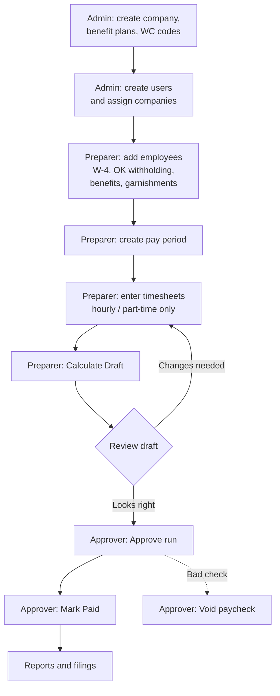
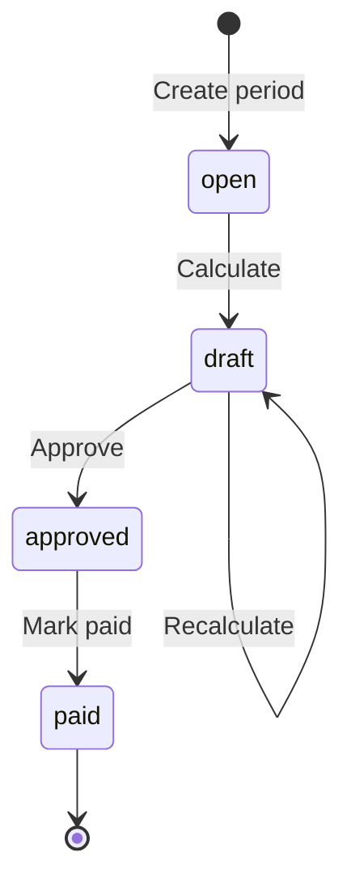
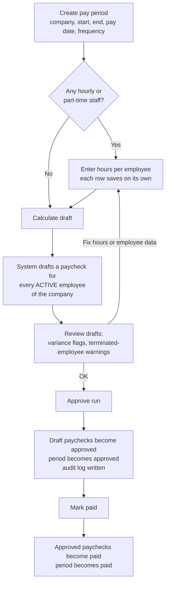
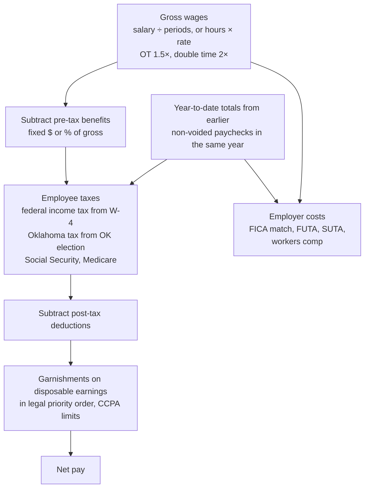
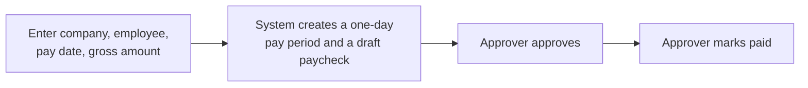
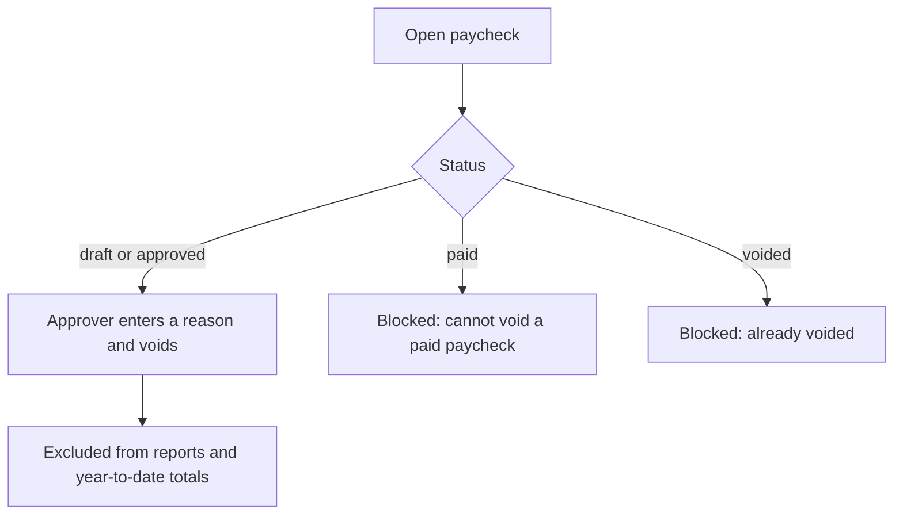
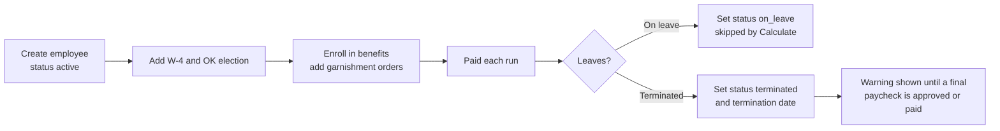
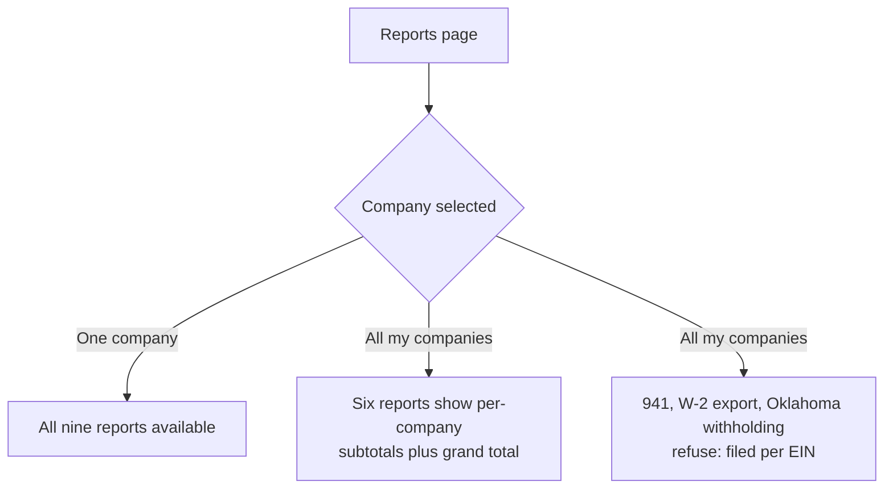
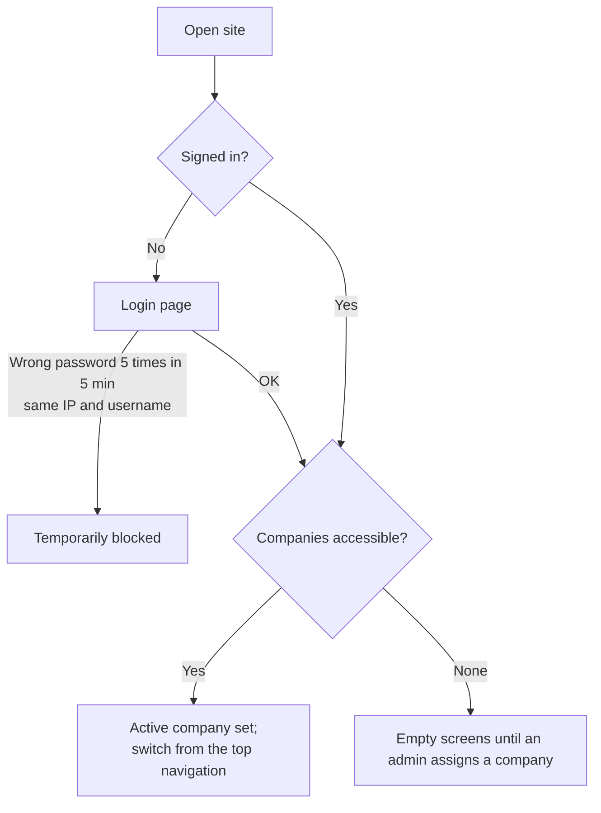

# Payroll Process Flow

How work moves through the system, from first-time setup to filing reports. Diagrams use [Mermaid](https://mermaid.js.org/) and render on GitHub. For step-by-step screen instructions, see [USER-MANUAL.md](USER-MANUAL.md).

## 1. Who can do what

Four roles control *what* a user may do. A separate company assignment controls *which companies* they may do it to. Admins bypass company assignment and see every company.

| Action | Admin | Preparer | Approver | Read-only |
|---|:-:|:-:|:-:|:-:|
| View employees, payroll, reports | ✓ | ✓ | ✓ | ✓ |
| Switch active company (among those assigned) | ✓ | ✓ | ✓ | ✓ |
| Add/edit employees, W-4 and Oklahoma elections, benefit enrollments, garnishments | ✓ | ✓ | | |
| Create pay periods and off-cycle payments, enter timesheets, calculate draft | ✓ | ✓ | | |
| Approve a payroll run, void a paycheck, mark a period paid | ✓ | | ✓ | |
| Company, benefit plan and workers comp code setup | ✓ | | | |
| User management and company assignment | ✓ | | | |

A user with no company assignment (other than an admin) sees no data. A record in a company the user cannot access returns "not found", not "forbidden".

## 2. End-to-end overview

## 3. Pay period lifecycle

A pay period moves in one direction. Each paycheck inside it has its own status.

| Period status | Timesheets editable | Can recalculate | Who moves it forward |
|---|:-:|:-:|---|
| `open` | Yes | Yes | Preparer (Calculate Draft) |
| `draft` | Yes | Yes | Approver (Approve) |
| `approved` | No | No | Approver (Mark paid) |
| `paid` | No | No | Final |

Paycheck status: `draft` → `approved` → `paid`. A paycheck can also become `voided`. Only paychecks in `draft` or `approved` can be voided; a `paid` paycheck cannot.

## 4. Payroll run, step by step

Notes on each step:

- **Calculate** replaces any existing draft paycheck for each employee, so it is safe to run repeatedly while the period is `open` or `draft`. It only drafts employees whose status is `active`.
- **Salaried** employees are paid annual salary divided by the number of periods in their pay frequency. Timesheets are ignored for them.
- **Hourly and part-time** employees are paid from their timesheet. With no timesheet, gross pay is $0.00.
- **Review flags** on the period page:
  - *Variance:* a draft whose gross differs from the employee's most recent approved or paid paycheck by more than 20%.
  - *Terminated employees needing a final paycheck:* terminated employees whose termination date is on or before the pay date and who have no approved or paid paycheck on or after that date.
- **Approve** and **mark paid** only work from the expected prior status. Doing them out of order returns an error.

## 5. What happens when a paycheck is calculated

The tax engine (`tax_engine/`) is pure calculation; the payroll service gathers the inputs and saves the result.

Inputs the calculation reads:

| Input | Source |
|---|---|
| Pay rate, employment type, pay frequency | Employee record (frequency falls back to the company's) |
| Federal withholding | Employee's latest W-4 election |
| Oklahoma withholding | Employee's latest Oklahoma election |
| Pre-tax and post-tax deductions | Active benefit enrollments. Fixed plans deduct a dollar amount; percent plans deduct that percent of the period's gross. An enrollment override uses the same unit as its plan. |
| Garnishments | Active garnishment orders |
| SUTA rate | Company setting; 2.7% if blank |
| Workers comp rate | Employee's workers comp code (rate per $100 of wages) |
| Year-to-date wages | Sum of earlier non-voided paychecks in the same calendar year |

**Employer match.** A plan with a match percentage adds an employer contribution line: the match percent of the employee's contribution, counting at most the cap percent of gross pay. For example, "100% up to 4%" on a $2,500 check matches at most $100. The match is employer money, so it never reduces the employee's net pay or appears in their deductions.

**Client liabilities.** Each calculated paycheck also records what must be sent to outside parties: one entry per garnishment order (to its payee), and one per benefit plan (to the plan, including any employer match). Retirement plans are typed as retirement deposits, other plans as benefit premiums, child support as child support remittances. The Client liabilities report counts these once the paycheck is approved. Drafts owe nothing, recalculating replaces them, and a voided paycheck drops out.

Garnishment priority: child support, federal tax levy, state tax levy, student loan, creditor and bankruptcy, then other. Amounts are capped by the Consumer Credit Protection Act limits.

## 6. Off-cycle payment

For a one-off payment to one employee outside the normal schedule.

The new period starts in `draft` so it follows the normal approve and mark-paid steps. For hourly and part-time employees the gross amount is converted to hours at their pay rate. For salaried employees the amount entered is the gross for that paycheck, in place of their per-period salary. The description you enter labels the earnings line.

## 7. Voiding a paycheck

The reason, user and time are saved. Voiding one paycheck does not change the pay period's status. A voided check is not replaced automatically.

## 8. Employee lifecycle

Only employees with status `active` are included in a payroll run. W-4 and Oklahoma elections are kept as history; the newest one by effective date is used. Benefit enrollments and garnishment orders are ended by giving an end date (they are not deleted).

## 9. Reports and filing scope

| Report | Consolidated across companies |
|---|:-:|
| Payroll register | Yes |
| Tax liability | Yes |
| Workers comp | Yes |
| Deductions and benefits | Yes |
| Client liabilities | Yes |
| New hire reporting | Yes |
| Quarterly 941 | No, run per company |
| Oklahoma withholding | No, run per company |
| W-2 CSV export | No, run per company |

Voided paychecks are always left out of reports.

## 10. Access and session flow

Access is re-checked on every request. If an admin removes a company from a user, it takes effect on that user's next click, not at next login. Every form that changes data is protected by a CSRF token.

## 11. Audit trail

The audit log records who changed what and when for: employee create and update, marking a new hire as reported, pay period create (including off-cycle), paycheck approve and void, user role and active-flag changes, and company assignment grants and revokes.

## 12. Known limitations

These are current behaviors, not bugs in your data:

- **Remittances cannot be marked as sent.** The Client liabilities report lists what is owed and shows the remitted amount, but no screen records a remittance yet, so remitted stays at $0.00.
- **Recalculating an off-cycle period redrafts everyone.** An off-cycle payment lives in its own one-day pay period. Choosing Recalculate on it drafts every active employee in the company, not just the one paid, and a salaried employee's entered amount is replaced by their normal salary. Approve the off-cycle period as created; to change it, void the paycheck and create a new off-cycle payment.
- **Employer share of insurance premiums** is not modeled. Only the employee's deduction (plus any employer match on the plan) appears in client liabilities.
- **Hourly minimum wage check** ($7.25) applies when creating an employee.
- The site runs over plain HTTP in the Docker test deployment. Use test data only.
